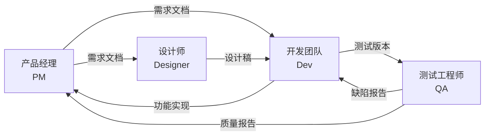
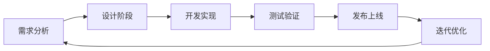

# 多角色协作原则

## 核心协作原则

本规范说明 PM、设计、开发、QA 在 OpenSpec 工作流中的协作边界：

- **目标一致性**：所有角色对产品目标、优先级达成共识
- **信息透明性**：通过共享记忆体系实现信息高效流通
- **专业互补性**：尊重各角色专业判断，发挥各自优势
- **主动协作性**：角色间主动沟通，消除信息孤岛
- **流程闭环性**：每个工作流程有明确的起点、过程与终点

## 角色与职责概览

### 角色核心职责表

| 角色 | 主导阶段 | 核心交付物 | 关键决策权限 |
|------|---------|-----------|------------|
| **产品经理(PM)** | 需求分析、产品规划 | `requirements.md`、产品原型、验收标准 | 功能优先级、验收标准 |
| **设计师** | 用户体验、视觉设计 | UI设计稿、设计系统 | 视觉呈现、交互模式 |
| **开发团队** | 技术方案、功能实现 | 代码、`design.md`、技术说明 | 技术选型、实现方式 |
| **测试工程师** | 测试执行、质量评估 | 测试报告、缺陷记录 | 测试策略、质量标准 |

## 简化协作流程

### 开发生命周期

### 阶段协作要点

#### 1. 需求阶段 (PM主导)
- **核心活动**：需求分析、用户场景、优先级排序
- **协作重点**：与各角色共同评审需求可行性
- **产出物**：需求文档、原型、验收标准

#### 2. 设计阶段 (设计师主导)
- **核心活动**：交互设计、视觉设计
- **协作重点**：与PM确认需求意图，与开发确认技术可行性
- **产出物**：UI设计稿、组件规范

#### 3. 开发阶段 (开发团队主导)
- **核心活动**：技术方案、功能实现、代码审查
- **协作重点**：需求细节澄清，设计还原确认
- **产出物**：功能代码、技术文档、API接口

#### 4. 测试阶段 (QA主导)
- **核心活动**：测试执行、缺陷管理、质量评估
- **协作重点**：与开发协作解决缺陷，与PM确认功能验收
- **产出物**：测试报告、缺陷记录、质量评估

#### 5. 发布与迭代阶段
- **核心活动**：上线部署、数据监控、迭代复盘
- **协作重点**：制定发布计划，快速响应线上问题
- **产出物**：发布记录、迭代总结

## 高效协作指南

### 信息共享准则
- 需求、任务、设计和验收口径优先沉淀到对应 `openspec/changes/<change-id>/`
- 关键决策形成文档并共享
- 定期同步项目状态与风险

### 沟通效率提升
- 问题描述：明确、具体、有上下文
- 会议准则：有议程、有记录、有行动项
- 冲突解决：基于数据与目标，而非个人偏好

### 风险管理简化框架
- **识别**：在每个阶段前识别可能风险
- **评估**：分析影响范围与严重程度
- **应对**：制定明确的应对策略与责任人
- **监控**：定期检查风险状态与应对效果
