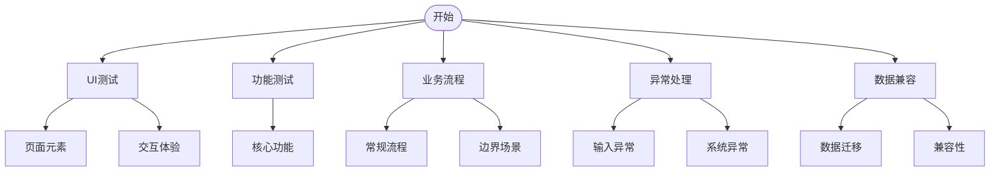

# 【产品名称】【功能名称】测试用例

## 测试点概览

## 1. UI测试

### TC001 - 页面元素和字段展示
- 优先级：P1
- 测试目的：确保页面元素和字段展示符合设计规范
- 前置条件：【前置条件】
- 测试步骤：
  1. 打开【测试页面】
  2. 检查【关键UI元素】
- 预期结果：
  1. UI元素符合设计规范（颜色、大小、字体）
  2. 页面布局整齐，字段展示正确无缺失
- 状态：[查看状态](#执行状态表格)

### TC002 - 交互体验
- 优先级：P1
- 测试目的：确保用户交互流畅，包括基础操作、筛选搜索和分页功能
- 前置条件：【前置条件】
- 测试步骤：
  1. 点击【操作元素】并触发【交互】
  2. 使用筛选搜索功能
  3. 测试列表分页功能
- 预期结果：
  1. 操作响应及时，交互反馈符合预期
  2. 筛选搜索结果正确，列表数据展示准确
  3. 分页功能正常，可正确跳转并显示数据
- 状态：[查看状态](#执行状态表格)

## 2. 功能测试

### TC003 - 核心功能1
- 优先级：P0
- 测试目的：确保【功能1】正常工作
- 前置条件：【前置条件】
- 测试步骤：
  1. 【步骤1】
  2. 【步骤2】
- 预期结果：【预期结果】
- 状态：[查看状态](#执行状态表格)

### TC004 - 核心功能2
- 优先级：P0
- 测试目的：确保【功能2】正常工作
- 前置条件：【前置条件】
- 测试步骤：【关键测试步骤】
- 预期结果：【预期结果】
- 状态：[查看状态](#执行状态表格)

## 3. 业务流程测试

### TC005 - 标准业务流程
- 优先级：P0
- 测试目的：确保完整标准业务流程正常运行
- 前置条件：【前置条件】
- 测试数据：【主要测试数据】
- 测试步骤：
  1. 【步骤1】
  2. 【步骤2】
  3. 【步骤3】
- 预期结果：【业务预期结果】
- 状态：[查看状态](#执行状态表格)

### TC006 - 业务分支流程
- 优先级：P1
- 测试目的：验证特定条件下的业务分支流程
- 前置条件：【前置条件】
- 测试数据：【特殊测试数据】
- 测试步骤：
  1. 【步骤1】
  2. 触发并执行分支流程
  3. 完成业务流程
- 预期结果：【分支流程预期结果】
- 状态：[查看状态](#执行状态表格)

### TC007 - 边界条件测试
- 优先级：P1
- 测试目的：验证边界条件下的业务流程
- 前置条件：【前置条件】
- 测试数据：【包含关键边界值的测试数据】
- 测试步骤：
  1. 使用边界值执行业务流程
  2. 验证结果
- 预期结果：系统正确处理边界条件，不引起异常
- 状态：[查看状态](#执行状态表格)

### TC008 - 并发场景测试
- 优先级：P2
- 测试目的：确保系统在并发操作下的数据一致性
- 前置条件：【前置条件】
- 测试环境：【并发用户数】、【操作类型】
- 测试步骤：
  1. 模拟多用户同时执行操作
  2. 验证数据一致性
- 预期结果：系统正常处理并发请求，数据一致性得到保障
- 状态：[查看状态](#执行状态表格)

## 4. 异常处理测试

### TC009 - 输入异常处理
- 优先级：P0
- 测试目的：确保系统能正确处理输入异常
- 前置条件：【前置条件】
- 测试步骤：【输入异常数据】并执行操作
- 预期结果：系统给出错误提示并正确处理异常
- 状态：[查看状态](#执行状态表格)

### TC010 - 系统异常处理
- 优先级：P2
- 测试目的：确保系统能正确处理系统级异常
- 前置条件：【前置条件】
- 测试步骤：模拟系统异常（网络中断、服务超时等）
- 预期结果：系统能识别并处理异常，保障数据一致性，并在恢复后正常运行
- 状态：[查看状态](#执行状态表格)

## 5. 数据兼容与迁移测试

### TC011 - 数据迁移测试
- 优先级：P0
- 测试目的：确保数据可以正确迁移到新系统
- 前置条件：【前置条件】
- 测试数据：标准数据、边界数据和异常数据
- 测试步骤：
  1. 执行数据备份和迁移
  2. 验证数据完整性和正确性
  3. 在新系统中执行功能测试
- 预期结果：数据完整迁移，无丢失或损坏，新系统能正常处理迁移数据
- 状态：[查看状态](#执行状态表格)

### TC012 - 未完成单据兼容测试
- 优先级：P0
- 测试目的：确保未完成单据可以在新系统中正确完结
- 前置条件：系统中存在不同状态的未完成单据
- 测试数据：【主要单据类型及状态】
- 测试步骤：
  1. 检查未完成单据在新系统中的显示
  2. 执行各类型单据的后续处理操作
  3. 验证新数据与迁移数据的交互
- 预期结果：未完成单据能在新系统中正确显示，处理和完结
- 状态：[查看状态](#执行状态表格)

## 执行状态表格

| 用例ID | 用例名称 | 优先级 | 执行状态 | 备注 |
|--------|---------|--------|---------|------|
| TC001 | [页面元素和字段展示](#tc001---页面元素和字段展示) | P1 | <input type="radio" name="TC001" value="未执行" checked> 未执行 <input type="radio" name="TC001" value="通过"> 通过 <input type="radio" name="TC001" value="失败"> 失败 |  |
| TC002 | [交互体验](#tc002---交互体验) | P1 | <input type="radio" name="TC002" value="未执行" checked> 未执行 <input type="radio" name="TC002" value="通过"> 通过 <input type="radio" name="TC002" value="失败"> 失败 |  |
| TC003 | [核心功能1](#tc003---核心功能1) | P0 | <input type="radio" name="TC003" value="未执行" checked> 未执行 <input type="radio" name="TC003" value="通过"> 通过 <input type="radio" name="TC003" value="失败"> 失败 |  |
| TC004 | [核心功能2](#tc004---核心功能2) | P0 | <input type="radio" name="TC004" value="未执行" checked> 未执行 <input type="radio" name="TC004" value="通过"> 通过 <input type="radio" name="TC004" value="失败"> 失败 |  |
| TC005 | [标准业务流程](#tc005---标准业务流程) | P0 | <input type="radio" name="TC005" value="未执行" checked> 未执行 <input type="radio" name="TC005" value="通过"> 通过 <input type="radio" name="TC005" value="失败"> 失败 |  |
| TC006 | [业务分支流程](#tc006---业务分支流程) | P1 | <input type="radio" name="TC006" value="未执行" checked> 未执行 <input type="radio" name="TC006" value="通过"> 通过 <input type="radio" name="TC006" value="失败"> 失败 |  |
| TC007 | [边界条件测试](#tc007---边界条件测试) | P1 | <input type="radio" name="TC007" value="未执行" checked> 未执行 <input type="radio" name="TC007" value="通过"> 通过 <input type="radio" name="TC007" value="失败"> 失败 |  |
| TC008 | [并发场景测试](#tc008---并发场景测试) | P2 | <input type="radio" name="TC008" value="未执行" checked> 未执行 <input type="radio" name="TC008" value="通过"> 通过 <input type="radio" name="TC008" value="失败"> 失败 |  |
| TC009 | [输入异常处理](#tc009---输入异常处理) | P0 | <input type="radio" name="TC009" value="未执行" checked> 未执行 <input type="radio" name="TC009" value="通过"> 通过 <input type="radio" name="TC009" value="失败"> 失败 |  |
| TC010 | [系统异常处理](#tc010---系统异常处理) | P2 | <input type="radio" name="TC010" value="未执行" checked> 未执行 <input type="radio" name="TC010" value="通过"> 通过 <input type="radio" name="TC010" value="失败"> 失败 |  |
| TC011 | [数据迁移测试](#tc011---数据迁移测试) | P0 | <input type="radio" name="TC011" value="未执行" checked> 未执行 <input type="radio" name="TC011" value="通过"> 通过 <input type="radio" name="TC011" value="失败"> 失败 |  |
| TC012 | [未完成单据兼容测试](#tc012---未完成单据兼容测试) | P0 | <input type="radio" name="TC012" value="未执行" checked> 未执行 <input type="radio" name="TC012" value="通过"> 通过 <input type="radio" name="TC012" value="失败"> 失败 |  |