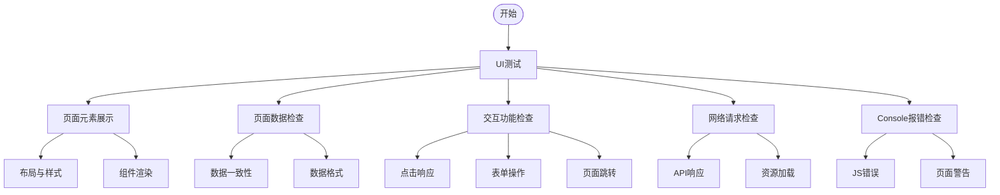

# 【产品名称】【功能名称】UI测试用例

## 测试环境信息

- **环境地址**：http://customer.qa.example.com/#/login?system=true
- **测试账号**：13982133221wx
- **账号密码**：123456

## 自动化测试配置

- **测试框架**：Playwright
- **运行方式**：Cursor MCP (Machine Controlled Programming)
- **浏览器**：Chromium (推荐), Firefox, WebKit

### Playwright基本设置

```javascript
// playwright.config.js 基础配置示例
const { defineConfig } = require('@playwright/test');

module.exports = defineConfig({
  testDir: './tests',
  timeout: 30000,
  expect: {
    timeout: 5000
  },
  use: {
    // 浏览器设置
    browserName: 'chromium',
    headless: false,
    viewport: { width: 1280, height: 720 },
    
    // 运行设置
    trace: 'on-first-retry',
    screenshot: 'only-on-failure',
    video: 'retain-on-failure',
    
    // 全局超时设置
    navigationTimeout: 30000,
    actionTimeout: 15000,
  },
  reporter: [
    ['html'],
    ['list']
  ],
});
```

### Cursor MCP运行方式

测试用例运行时，使用Cursor MCP工具方式来执行测试，具体步骤：

1. 在Cursor界面使用 MCP Playwright 相关命令来控制浏览器
2. 进行页面操作和断言检查
3. 自动生成报告

示例MCP命令序列：
```
mcp_playwright_browser_navigate(url)
mcp_playwright_browser_type(element, ref, text)
mcp_playwright_browser_click(element, ref)
mcp_playwright_browser_snapshot()
```

## 测试点概览



## 1. 页面元素展示检查

### TC001 - 页面布局与样式检查
- 优先级：P1
- 测试目的：确保页面布局与样式符合设计规范
- 前置条件：使用测试账号(13982133221wx)登录系统
- 测试步骤：
  1. 打开【测试页面URL】
  2. 检查页面整体布局（如导航栏、内容区、侧边栏等位置）
  3. 检查各组件间的间距是否合理
  4. 检查字体、颜色、尺寸是否符合设计规范
  5. 检查在不同窗口大小下的响应式布局表现
- 预期结果：
  1. 页面布局与设计稿一致
  2. 组件间距合理，视觉效果协调
  3. 字体、颜色、尺寸符合UI规范
  4. 响应式布局正常，无溢出、遮挡问题
- 自动化实现：
  ```javascript
  // 使用Cursor MCP执行自动化测试
  // 1. 导航到目标页面
  mcp_playwright_browser_navigate({
    url: "http://customer.qa.example.com/#/目标页面路径"
  });
  
  // 2. 获取页面快照进行元素检查
  mcp_playwright_browser_snapshot();
  
  // 3. 检查关键元素是否存在且样式正确
  // (在获取到的快照中进行元素定位和检查)
  
  // 4. 调整浏览器大小测试响应式布局
  mcp_playwright_browser_resize({
    width: 768,
    height: 1024
  });
  
  // 5. 再次获取快照检查响应式布局
  mcp_playwright_browser_snapshot();
  ```

### TC002 - 页面组件渲染检查
- 优先级：P1
- 测试目的：确保页面所有组件正确渲染，无缺失
- 前置条件：使用测试账号(13982133221wx)登录系统
- 测试步骤：
  1. 打开【测试页面URL】
  2. 检查页面头部元素（标题、logo、导航等）
  3. 检查页面主体内容区域的组件（表格、表单、按钮等）
  4. 检查页面底部元素（页脚、版权信息等）
  5. 检查特殊状态下的元素显示（如悬停、选中等）
- 预期结果：
  1. 所有组件完整显示，无缺失
  2. 组件内容正确，文本无错别字
  3. 图标、图片正确加载，无占位图或加载失败情况
  4. 特殊状态下元素显示正常
- 自动化实现：
  ```javascript
  // 使用Cursor MCP执行自动化测试
  // 1. 导航到目标页面
  mcp_playwright_browser_navigate({
    url: "http://customer.qa.example.com/#/目标页面路径"
  });
  
  // 2. 获取页面快照进行元素检查
  mcp_playwright_browser_snapshot();
  
  // 3. 检查主要组件是否存在
  // (检查标题、表格、按钮等关键元素)
  
  // 4. 测试悬停状态
  mcp_playwright_browser_hover({
    element: "按钮元素",
    ref: "hover-target-ref"
  });
  
  // 5. 获取悬停状态下的快照
  mcp_playwright_browser_snapshot();
  ```

## 2. 页面数据检查

### TC003 - 页面数据加载与一致性
- 优先级：P0
- 测试目的：确保页面加载的数据与后端提供数据一致
- 前置条件：使用测试账号(13982133221wx)登录系统
- 测试步骤：
  1. 打开【测试页面URL】
  2. 观察页面加载的数据（如列表、详情等）
  3. 通过开发者工具Network面板查看API返回的原始数据
  4. 对比页面显示数据与API返回数据
  5. 检查数据翻页、筛选后的数据一致性
- 预期结果：
  1. 页面显示数据与API返回数据完全一致
  2. 分页数据正确，总数显示正确
  3. 筛选、排序后的数据与预期一致
  4. 无数据时显示空状态提示
- 自动化实现：
  ```javascript
  // 使用Cursor MCP执行自动化测试
  // 1. 导航到目标页面
  mcp_playwright_browser_navigate({
    url: "http://customer.qa.example.com/#/目标页面路径"
  });
  
  // 2. 获取页面快照及网络请求数据
  mcp_playwright_browser_snapshot();
  mcp_playwright_browser_network_requests();
  
  // 3. 检查数据一致性
  // (比对页面显示数据与API响应数据)
  
  // 4. 测试分页功能
  mcp_playwright_browser_click({
    element: "下一页按钮",
    ref: "next-page-button"
  });
  
  // 5. 再次获取快照和网络请求
  mcp_playwright_browser_snapshot();
  mcp_playwright_browser_network_requests();
  ```

### TC004 - 数据格式与展示
- 优先级：P1
- 测试目的：确保各类型数据格式化展示正确
- 前置条件：使用测试账号(13982133221wx)登录系统
- 测试步骤：
  1. 打开【测试页面URL】
  2. 检查日期/时间格式化展示
  3. 检查金额/数字的格式化（千分位、小数点等）
  4. 检查长文本的截断和提示
  5. 检查特殊字符的显示（如HTML标签、emoji等）
- 预期结果：
  1. 日期时间格式符合规范（如YYYY-MM-DD）
  2. 数字金额格式正确（如￥1,000.00）
  3. 长文本适当截断并提供完整查看方式
  4. 特殊字符正确显示，不出现乱码或解析错误
- 自动化实现：
  ```javascript
  // 使用Cursor MCP执行自动化测试
  // 1. 导航到目标页面
  mcp_playwright_browser_navigate({
    url: "http://customer.qa.example.com/#/目标页面路径"
  });
  
  // 2. 获取页面快照
  mcp_playwright_browser_snapshot();
  
  // 3. 检查各类数据格式是否正确
  // (验证日期格式、金额格式等)
  
  // 4. 检查长文本截断和提示
  mcp_playwright_browser_hover({
    element: "长文本元素",
    ref: "long-text-element"
  });
  
  // 5. 再次获取快照检查提示效果
  mcp_playwright_browser_snapshot();
  ```

## 3. 交互功能检查

### TC005 - 基础交互功能
- 优先级：P0
- 测试目的：确保页面基础交互元素响应正确
- 前置条件：使用测试账号(13982133221wx)登录系统
- 测试步骤：
  1. 点击页面各按钮，观察响应
  2. 悬停在提示元素上，检查tooltip显示
  3. 点击链接，检查跳转
  4. 使用Tab键切换焦点，测试键盘可访问性
  5. 测试下拉菜单、展开/折叠面板等交互元素
- 预期结果：
  1. 按钮点击有视觉反馈，功能正确触发
  2. tooltip正确显示，位置合适，内容完整
  3. 链接跳转正确，无死链
  4. 键盘Tab焦点顺序合理，可聚焦元素可通过键盘操作
  5. 交互组件展开/折叠/选择功能正常
- 自动化实现：
  ```javascript
  // 使用Cursor MCP执行自动化测试
  // 1. 导航到目标页面
  mcp_playwright_browser_navigate({
    url: "http://customer.qa.example.com/#/目标页面路径"
  });
  
  // 2. 测试按钮点击
  mcp_playwright_browser_click({
    element: "主操作按钮",
    ref: "main-action-button"
  });
  
  // 3. 获取快照验证操作结果
  mcp_playwright_browser_snapshot();
  
  // 4. 测试悬停提示
  mcp_playwright_browser_hover({
    element: "提示元素",
    ref: "tooltip-element"
  });
  
  // 5. 测试键盘Tab键操作
  mcp_playwright_browser_press_key({
    key: "Tab"
  });
  
  // 6. 再次获取快照检查焦点状态
  mcp_playwright_browser_snapshot();
  ```

### TC006 - 表单交互检查
- 优先级：P0
- 测试目的：验证表单操作和提交功能正确
- 前置条件：使用测试账号(13982133221wx)登录系统
- 测试步骤：
  1. 在表单输入框中输入各类数据（正常值、边界值、特殊字符等）
  2. 测试表单验证功能（必填、格式、长度等限制）
  3. 测试表单提交功能
  4. 测试表单重置功能
  5. 测试表单在提交过程中的UI状态（loading等）
- 预期结果：
  1. 输入框正确接收和显示输入数据
  2. 表单验证正确触发，错误提示清晰
  3. 表单提交后数据正确传递到后端（通过Network面板验证）
  4. 重置功能正确清除/恢复表单数据
  5. 提交过程中有loading状态，防止重复提交
- 自动化实现：
  ```javascript
  // 使用Cursor MCP执行自动化测试
  // 1. 导航到表单页面
  mcp_playwright_browser_navigate({
    url: "http://customer.qa.example.com/#/表单页面路径"
  });
  
  // 2. 输入表单数据
  mcp_playwright_browser_type({
    element: "用户名输入框",
    ref: "username-input",
    text: "测试用户名"
  });
  
  mcp_playwright_browser_type({
    element: "金额输入框",
    ref: "amount-input",
    text: "1000"
  });
  
  // 3. 获取快照检查表单状态
  mcp_playwright_browser_snapshot();
  
  // 4. 测试表单提交
  mcp_playwright_browser_click({
    element: "提交按钮",
    ref: "submit-button"
  });
  
  // 5. 获取网络请求验证数据提交
  mcp_playwright_browser_network_requests();
  
  // 6. 获取快照检查提交结果/状态
  mcp_playwright_browser_snapshot();
  ```

### TC007 - 高级交互功能
- 优先级：P1
- 测试目的：验证复杂交互功能的正确性
- 前置条件：使用测试账号(13982133221wx)登录系统
- 测试步骤：
  1. 测试拖拽功能（如有）
  2. 测试文件上传功能（如有）
  3. 测试富文本编辑器功能（如有）
  4. 测试图表交互功能（如有）
  5. 测试其他特定业务场景的复杂交互
- 预期结果：
  1. 拖拽操作响应流畅，结果正确
  2. 文件上传功能正常，支持预览、进度显示
  3. 富文本编辑器各功能正常，内容保存正确
  4. 图表交互（缩放、筛选等）功能正常
  5. 特定业务交互功能符合需求预期
- 自动化实现：
  ```javascript
  // 使用Cursor MCP执行自动化测试
  // 1. 导航到目标页面
  mcp_playwright_browser_navigate({
    url: "http://customer.qa.example.com/#/高级功能页面路径"
  });
  
  // 2. 测试文件上传功能
  mcp_playwright_browser_file_upload({
    paths: ["/path/to/test/file.jpg"]
  });
  
  // 3. 获取快照检查上传结果
  mcp_playwright_browser_snapshot();
  
  // 4. 测试拖拽功能
  mcp_playwright_browser_drag({
    startElement: "拖拽源元素",
    startRef: "drag-source-ref",
    endElement: "拖拽目标元素",
    endRef: "drag-target-ref"
  });
  
  // 5. 获取快照检查拖拽结果
  mcp_playwright_browser_snapshot();
  ```

## 4. 网络请求检查

### TC008 - API请求与响应检查
- 优先级：P0
- 测试目的：确保页面与后端交互的网络请求正确
- 前置条件：使用测试账号(13982133221wx)登录系统
- 测试步骤：
  1. 打开浏览器开发者工具的Network面板
  2. 打开【测试页面URL】，观察页面加载时的请求
  3. 执行各种操作（点击、提交等），观察触发的请求
  4. 检查请求参数、请求头、响应状态码、响应数据
  5. 测试请求失败场景（如断网、服务器错误等）下的页面表现
- 预期结果：
  1. 请求URL正确，参数格式合规
  2. 请求头包含必要信息（如认证信息）
  3. 响应状态码正常（2xx），无非预期的错误码
  4. 响应数据格式符合API文档规范
  5. 请求失败时有适当的错误提示，不影响页面其他功能
- 自动化实现：
  ```javascript
  // 使用Cursor MCP执行自动化测试
  // 1. 导航到目标页面
  mcp_playwright_browser_navigate({
    url: "http://customer.qa.example.com/#/目标页面路径"
  });
  
  // 2. 获取网络请求
  mcp_playwright_browser_network_requests();
  
  // 3. 执行触发网络请求的操作
  mcp_playwright_browser_click({
    element: "加载数据按钮",
    ref: "load-data-button"
  });
  
  // 4. 再次获取网络请求，验证新的请求
  mcp_playwright_browser_network_requests();
  
  // 5. 获取快照检查数据加载结果
  mcp_playwright_browser_snapshot();
  ```

### TC009 - 静态资源加载检查
- 优先级：P1
- 测试目的：确保页面静态资源正确加载，无404等错误
- 前置条件：使用测试账号(13982133221wx)登录系统
- 测试步骤：
  1. 打开浏览器开发者工具的Network面板
  2. 打开【测试页面URL】，观察所有资源加载情况
  3. 检查JS、CSS、图片等资源是否正确加载
  4. 查看资源加载时间，识别可能的性能问题
  5. 检查是否有资源加载失败的情况
- 预期结果：
  1. 所有资源响应状态码为200，无404或其他错误
  2. 资源加载时间在合理范围内
  3. 资源大小合理，无过大文件影响性能
  4. CDN资源链接有效，无失效情况
- 自动化实现：
  ```javascript
  // 使用Cursor MCP执行自动化测试
  // 1. 导航到目标页面
  mcp_playwright_browser_navigate({
    url: "http://customer.qa.example.com/#/目标页面路径"
  });
  
  // 2. 获取所有网络请求
  mcp_playwright_browser_network_requests();
  
  // 3. 分析请求结果，检查是否有404或其他错误状态码
  // (需要在获取请求后进行分析)
  
  // 4. 获取快照确认页面正常显示
  mcp_playwright_browser_snapshot();
  ```

## 5. Console报错检查

### TC010 - 控制台错误检查
- 优先级：P0
- 测试目的：确保页面无JavaScript错误和严重警告
- 前置条件：使用测试账号(13982133221wx)登录系统
- 测试步骤：
  1. 打开浏览器开发者工具的Console面板
  2. 打开【测试页面URL】，观察初始加载是否有错误
  3. 执行各种页面操作，观察是否触发新的错误
  4. 检查是否有红色错误信息或黄色警告信息
  5. 记录并分析发现的所有错误和警告信息
- 预期结果：
  1. 页面加载和操作过程中无JavaScript错误
  2. 无严重影响功能的警告信息
  3. 如有非关键警告，应该记录并评估影响
  4. 第三方库或插件不产生影响功能的错误
- 自动化实现：
  ```javascript
  // 使用Cursor MCP执行自动化测试
  // 1. 导航到目标页面
  mcp_playwright_browser_navigate({
    url: "http://customer.qa.example.com/#/目标页面路径"
  });
  
  // 2. 获取控制台消息
  mcp_playwright_browser_console_messages();
  
  // 3. 执行页面操作
  mcp_playwright_browser_click({
    element: "主要功能按钮",
    ref: "main-feature-button"
  });
  
  // 4. 再次获取控制台消息，检查是否有新的错误
  mcp_playwright_browser_console_messages();
  
  // 5. 获取快照确认页面功能正常
  mcp_playwright_browser_snapshot();
  ```

### TC011 - 浏览器兼容性检查
- 优先级：P1
- 测试目的：确保页面在各目标浏览器中正常工作，无兼容性报错
- 前置条件：使用测试账号(13982133221wx)登录系统
- 测试步骤：
  1. 在各目标浏览器中打开测试页面
  2. 检查页面布局和样式是否一致
  3. 测试核心交互功能
  4. 查看Console面板中是否有浏览器特定的错误
  5. 测试响应式布局在不同设备视口大小下的表现
- 预期结果：
  1. 页面在所有目标浏览器中布局一致
  2. 所有功能在各浏览器中均正常工作
  3. 无浏览器特定的JavaScript错误和警告
  4. 响应式布局在各浏览器中表现一致
- 自动化实现：
  ```javascript
  // 多浏览器测试使用Playwright的跨浏览器功能
  // 此处仅展示在Chromium中的测试，实际需要在多个浏览器中执行类似代码
  
  // 1. 导航到目标页面
  mcp_playwright_browser_navigate({
    url: "http://customer.qa.example.com/#/目标页面路径"
  });
  
  // 2. 获取快照检查布局
  mcp_playwright_browser_snapshot();
  
  // 3. 获取控制台消息检查错误
  mcp_playwright_browser_console_messages();
  
  // 4. 调整窗口大小测试响应式布局
  mcp_playwright_browser_resize({
    width: 768,
    height: 1024
  });
  
  // 5. 再次获取快照检查响应式布局
  mcp_playwright_browser_snapshot();
  ```

## 附录：完整自动化测试示例

下面是一个完整的登录测试示例，演示如何使用Playwright和Cursor MCP进行自动化测试：

```javascript
// 登录流程自动化测试示例

// 1. 导航到登录页面
mcp_playwright_browser_navigate({
  url: "http://customer.qa.example.com/#/login?system=true"
});

// 2. 获取页面快照确认登录页面加载完成
mcp_playwright_browser_snapshot();

// 3. 输入用户名
mcp_playwright_browser_type({
  element: "用户名输入框",
  ref: "username-input",
  text: "13982133221wx"
});

// 4. 输入密码
mcp_playwright_browser_type({
  element: "密码输入框",
  ref: "password-input",
  text: "123456"
});

// 5. 点击登录按钮
mcp_playwright_browser_click({
  element: "登录按钮",
  ref: "login-button"
});

// 6. 等待登录完成
mcp_playwright_browser_wait_for({
  text: "登录成功"
});

// 7. 获取网络请求验证登录API调用
mcp_playwright_browser_network_requests();

// 8. 获取快照确认登录成功并进入系统
mcp_playwright_browser_snapshot();

// 9. 获取控制台消息确认无错误
mcp_playwright_browser_console_messages();
```
